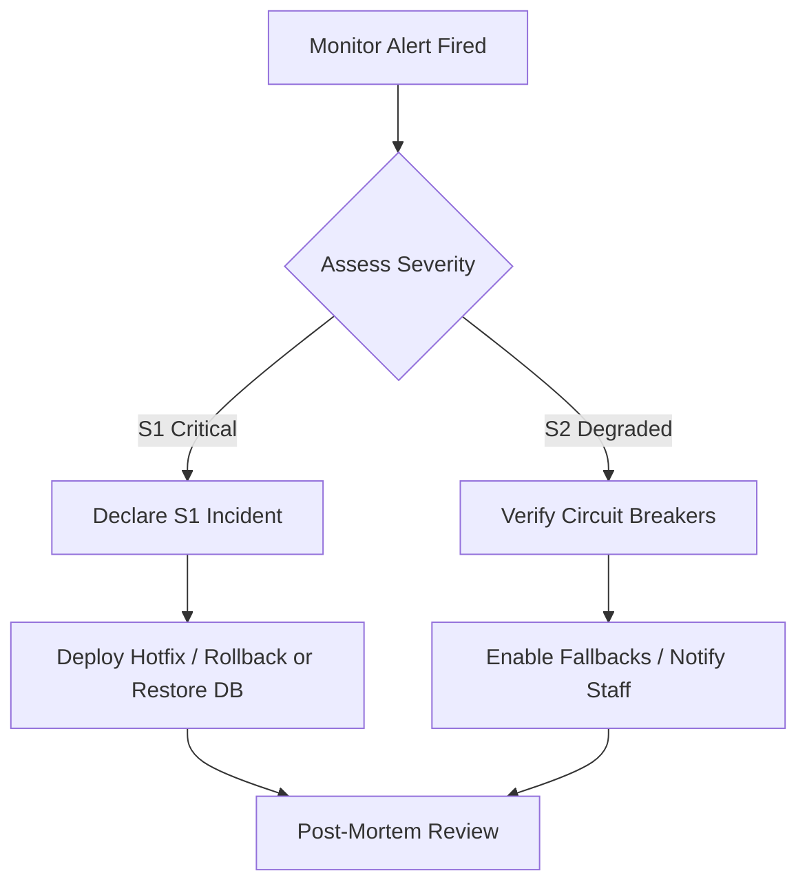

# Business Continuity & Incident Response Plan

This document establishes procedures for maintaining operation continuity during outage incidents.

---

## 1. Incident Severity Levels

- **S1 (Critical Outage)**: Primary application down, payment systems failing, database unreachable, or storage corrupted. Target Recovery Time Objective (RTO): < 30 minutes.
- **S2 (Major Degraded)**: Caching cluster down, Search failing, email provider failing. System is operational but runs in fallback degraded states. RTO: < 2 hours.
- **S3 (Minor Issue)**: AI provider circuit breaker open, realtime streams disabled. System automatically falls back (HTTP polling / AI features hidden). RTO: < 24 hours.

---

## 2. Incident Response Workflow



---

## 3. Service Degradation Plan (Grace Fallbacks)

- **AI Down (OpenRouter Outage)**:
  - Circuit breaker `openRouterBreaker` enters `OPEN` state.
  - Platform automatically disables AI assistant panel, AI thread summary widgets, and falls back to manual moderation.
- **Search Down (Typesense Outage)**:
  - Circuit breaker `typesenseBreaker` opens.
  - Search queries fall back to database SQL queries (`LIKE` matching on thread content and posts).
- **Realtime Down (Ably Outage)**:
  - Circuit breaker `ablyBreaker` opens.
  - Web client shifts to HTTP cursor-polling every 10 seconds to update notification counters and chat feeds.

---

## 4. Rollback Procedures

If a deployment triggers high error rates:

### Step 1: Trigger rollback on Coolify / Docker stack
Execute roll back to the previously tagged stable image:
```bash
docker pull registry.local/bhw-pas:stable
docker-compose up -d --no-deps web
```

### Step 2: Database Migration Rollbacks
If a migration was breaking, run the down migration (if available) or restore the hourly DB snapshot.
Avoid DB rollbacks if transactions have accumulated; prefer hot-fixing schema constraints.
